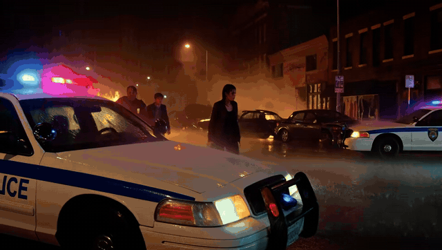
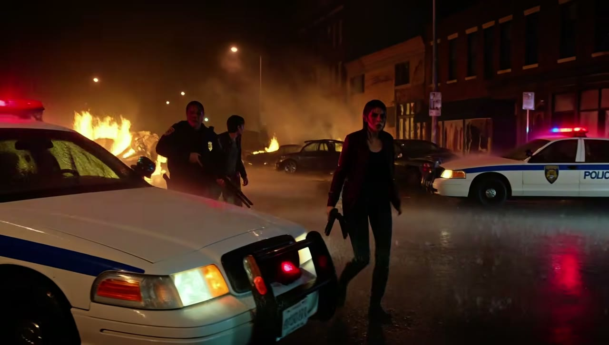

# One Node - MiniMax H3 (video + native audio)

A single-node ComfyUI front end for **MiniMax H3**. It generates video with native
stereo audio and exposes text-to-video, image-to-video, first/last-frame animation,
reference-to-video, protected HD refinement, repair, continuation, and upscaling in
one panel. Pressing **Generate** builds and submits a real ComfyUI graph; no manual
wiring is required.

> 📘 **Start here:** [MiniMax H3 One Node v3.24 User Guide (PDF)](MiniMax-H3-One-Node-v3.24-User-Guide.pdf)
> — an illustrated walkthrough covering installation, models, generation modes,
> Reference mode, LoRAs, and the protected 15-second 1080p/2K workflow.

> **Hardware target:** optimized and tested for **NVIDIA RTX GPUs with 16 GB VRAM**.
> The protected 15-second presets use model offload, FP32 latent upscaling, small
> temporal windows, CPU accumulation, and a low-denoise second pass to reach
> ratio-aware 1080p or 2K-class output on this target.

> **Coming soon:** a separate **8 GB VRAM optimized edition** is in development.
> The current release should not be presented as an 8 GB guarantee.

## Release documentation

- [Detailed installation guide](INSTALL.md)
- [Illustrated v3.24 user guide (PDF)](MiniMax-H3-One-Node-v3.24-User-Guide.pdf)
- [Companion nodes and credits](CREDITS.md)
- [Optional CREATE assistant guide](docs/CREATE_ASSISTANT.md)
- [License](LICENSE) and [third-party notice](NOTICE)

## Highlights in v3.24

- **Protected 15s / 16GB presets:** one click configures a 0.5 MP draft, FP32
  neural latent upscale, 20-frame CPU-fused H3 windows, locked stage-1 audio,
  and a 4-step refine at 0.20 denoise.
- **1080p and 2K buttons are aspect-ratio aware.** A 9:16 job produces a vertical
  canvas; a 16:9 job produces a horizontal canvas. The 1080-class target is 2 MP
  (for example 1088 x 1920 or 1920 x 1088). The 2K-class target is 4 MP.
- **Pinned LightX recipes:** the selected 4-step or 8-step file controls the matching
  schedule, so a newly added checkpoint cannot silently replace a saved recipe.
- **Anime Motion quick-add:** tuned for I2V and available as a conservative beta in
  Reference mode. Always check identity and audio before a final render.
- **H3 Studio, repair, finish, and upscaling:** optional tools are detected at run
  time and only used when their companion node packs are installed.
- **CREATE:** an optional text-only Qwen prompt assistant with offline MiniMax H3
  prompt guidance. It cannot submit renders or inspect attached media.

## Optimized RTX 5070 Ti demo

[](https://youtu.be/E660Vg4-0-o)

**Video:** [Minimax H3 local render Text to video with my Optimized One node RTX 5070 Ti](https://youtu.be/E660Vg4-0-o)

This full 15-second local text-to-video shot was rendered with the optimized One
Node on an NVIDIA RTX 5070 Ti. The README preview is compressed and silent; click
the animation to watch the 1080p version with audio on YouTube.

### Promo stills

| Opening setup | Character moment | Final reveal |
| :---: | :---: | :---: |
| [](https://youtu.be/E660Vg4-0-o) | [](https://youtu.be/E660Vg4-0-o) | [](https://youtu.be/E660Vg4-0-o) |

## Main generation modes

| Mode | Backend | Purpose |
| --- | --- | --- |
| **T2V** | `MiniMaxH3ImageToVideo` / FL2VA | Generate video and audio from a prompt. |
| **I2V** | `MiniMaxH3ImageToVideo` / FL2VA | Animate a first frame, or bridge first and last frames. |
| **R2V** | `MiniMaxH3ReferenceToVideo` / Ref2VA | Use image, video, and audio references for identity, style, motion, camera, or voice. |

MiniMax H3 is guidance-distilled. The graph uses positive conditioning and does not
provide a traditional negative-prompt or CFG control. Describe the wanted scene,
camera, action, sound, and restrictions clearly in the main prompt.

## Quick install

```bash
cd ComfyUI/custom_nodes
git clone https://github.com/Johnzx07/ComfyUI-MiniMaxH3-OneNode.git
```

Update ComfyUI, restart it, then add:

**MiniMaxH3-OneNode -> One Node - MiniMax H3 (video + audio)**

The core T2V, I2V, and R2V modes use ComfyUI's native MiniMax H3 nodes. The protected
HD recipe additionally needs **ComfyUI-MMH3Tools** and the **MiniMax H3 Latent
Upscaler**. Optional tabs identify their missing companion packs inside the panel.
See [INSTALL.md](INSTALL.md) for model paths, exact companion repositories, portable
Python commands, updates, and troubleshooting.

## Required model files

Model weights are not bundled. Download compatible ComfyUI files from
[Comfy-Org/MiniMax-H3](https://huggingface.co/Comfy-Org/MiniMax-H3) and follow each
model card's license and use terms.

```text
ComfyUI/models/
|-- diffusion_models/
|   |-- minimax_h3_fl2va_pruned_fp8_scaled.safetensors   # T2V / I2V
|   `-- minimax_h3_ref2va_pruned_fp8_scaled.safetensors  # R2V
|-- text_encoders/
|   `-- qwen3vl_32b_minimax_h3_int8_convrot.safetensors
`-- vae/
    |-- minimax_h3_video_vae_fp16.safetensors
    `-- minimax_h3_audio_vae_fp32.safetensors
```

Equivalent supported INT8 or Blackwell-oriented quantizations can be selected in
the **Models** panel. Use **Rescan models** after adding files.

## Protected 15-second recipe

Open **Advanced -> Two-pass HD**, then choose **1080p** or **2K** under
**Protected 15s / 16GB recipe**. The button sets the complete known-good route:

1. Generate 362 frames at 24 fps from a 0.5 MP draft.
2. Split video and audio latents.
3. Upscale the video latent with the FP32 H3 3D latent upscaler.
4. Rejoin and lock the original stage-1 audio.
5. Refine the target canvas through small overlapping H3 windows on a CPU
   accumulator.
6. Decode once and save the final video.

For hero shots, keep Turbo and cache accelerators off. The protected button saves
setup time; it does not change the selected aspect ratio.

## Anime Motion LoRA

Install the MiniMax H3 Turbo companion node, place the Anime Motion LoRA in
`ComfyUI/models/loras/`, then use **Advanced -> Style LoRA -> Anime Motion**.

- **I2V:** recommended starting strength is 1.0.
- **R2V:** starts conservatively at 0.65 and is marked beta. Verify identity, motion,
  and audio on a short test before a final render.
- The LoRA animates H3 video. It is not a text-to-image model.

## Privacy and local state

The repository contains no model weights, full-resolution renders, API tokens,
machine paths, or personal favorites. Its only generated-media assets are the
compressed public demo GIF and three promotional stills above. Runtime preferences
are stored under the user's ComfyUI data directory and are excluded from releases.
The optional CREATE assistant keeps its API token in memory for the current
connection; it is not written to the repository, browser storage, or the node's
config file.

## Verification

The release includes CPU/headless tests for graph construction, mode routing,
reference keys, resolution and duration math, prompt validation, assistant request
guards, and JavaScript/Python syntax. Before packaging, the protected two-pass graph
also passed its byte-for-byte v3.23 regression check. A real protected 1080p,
10-second I2V render completed on the 16 GB target configuration.

## Credits and license

This wrapper is licensed under Apache-2.0. It does not reimplement MiniMax H3 and
does not bundle model weights. MiniMax H3, ComfyUI, the official prompt-writing
material, and every optional companion pack remain the work of their respective
authors under their own licenses. See [CREDITS.md](CREDITS.md) and [NOTICE](NOTICE).

Not affiliated with MiniMax or Comfy-Org. Use generated speech and reference media
responsibly and obtain consent where required.

Made by **[The New Game Plus](https://www.youtube.com/@TheNewGamePluss)** -
[Ko-fi](https://ko-fi.com/thenewgameplus)
